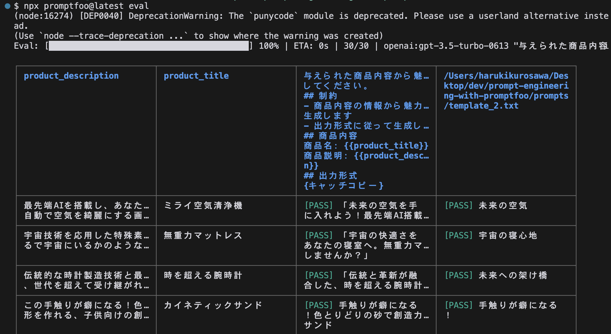
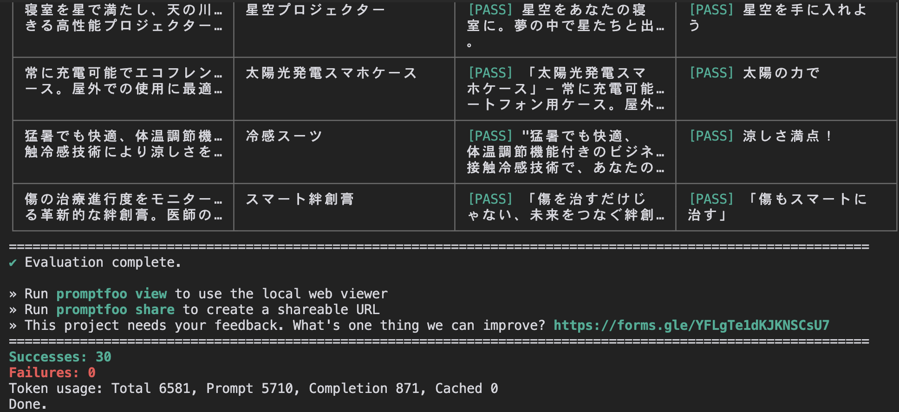
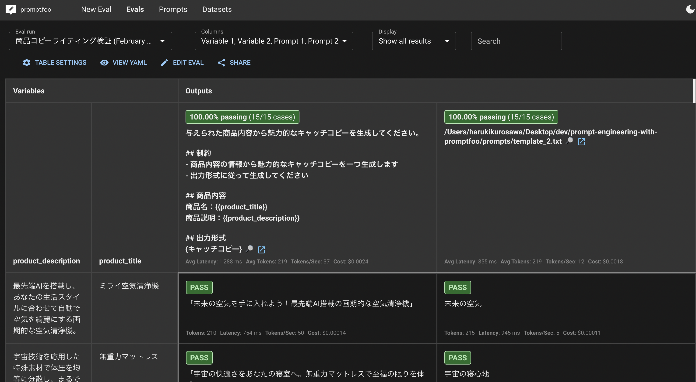
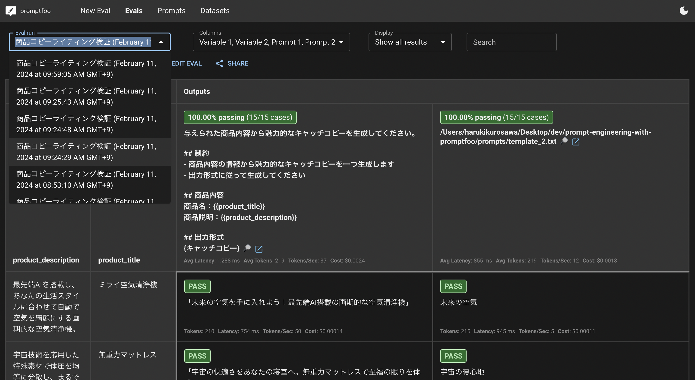
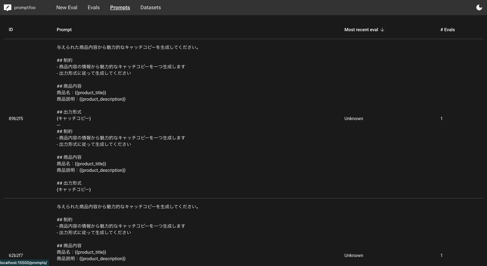
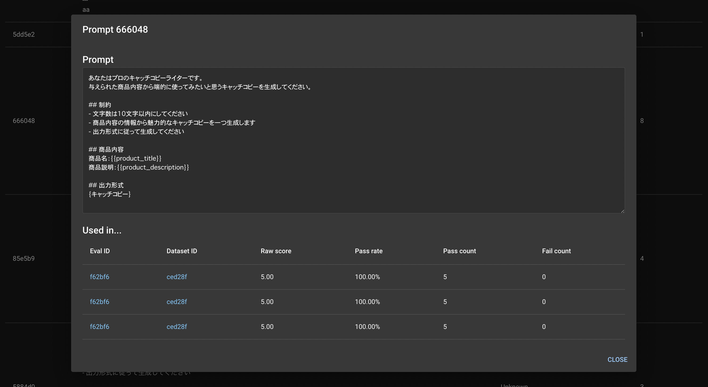

# prompt-engineering-with-promptfoo

`promptfoo`を使って、プロンプトエンジニアリングの実験管理を行う方法についてまとめました。

進め方については公式ドキュメントの[こちら](https://www.promptfoo.dev/docs/intro)からご参考ください。


## セットアップ

実行に当たって、以下の準備が必要です。

1. リポジトリをクローンします
   ```
   git clone git@github.com:h-k-nyosu/prompt-engineering-with-promptfoo.git
   ```
2. npxをインストールします。
   ```
   npm install -g npx
   ```
3. OPENAI_API_KEYを環境変数として設定します。
   ```
   export OPENAI_API_KEY=your_api_key
   ```


## promptfooを使う

prompfconfig.yamlには、プロンプトと利用するLLM（プロバイダー）、テストケースが記載されています。
※ここでは商品のキャッチコピーを作るプロンプトを比較検証しています

この情報を用いて、以下のコマンドを実行すると、実験結果が走ります。

```
npx prompftoo@latest eval
```

実行して少しの待ち時間の後に、各テストケースに対応した生成結果が出力されます。

左の二列がテストケースの変数、右二列が生成結果となります。



また出力結果の下部には、どれくらいのトークンを利用したかなどが記載されています。また`Cached`という項目があり、一度実行した内容はキャッシュを用いて出力してくれるのが推しポイントです。



`promptfoo`には、WebUIの機能が備わっています。以下のコマンドを実行すると、先ほど実行した結果をWeb上で確認できます。

```
npx promptfoo@latest view
```

レイテンシーやコストなども確認できるのはアツいですね。



なおこの実行に関するデータは`~/.promptfoo`に格納されており、ローカル環境に留まっています。

左上のドロップダウンから、過去の実験結果も振り返ることができます。



上部のPromptsタブからは、プロンプトに対してIDが振られており、そこに紐づく実験結果も確認することができます。これも便利！





`Pass count`や`Fail count`が書いてありますが、これはテストケースに対して評価設定を追加した場合に、その評価結果が集計されるようになっています。

`promptconfig.yaml`にいくつかの評価（assert）をコメントアウトで記載していますので、試してみてください。


## 解説

`promptfooconfig.yaml`ファイルで管理します。ここでは、
- 実験の名前（description）
- どのプロンプトを利用するか（prompts）
- どのAPIを利用するか（provider）
- どのような入力値で検証するか（tests, tests.vars）

が記述されています。promptfooのconfigの詳細仕様については[公式ドキュメント](https://www.promptfoo.dev/docs/configuration/reference)をご参照ください。色々な設定ができます。

```promptfooconfig.yaml
description: '商品コピーライティング検証'

prompts:
  - prompts/template_1.txt
  - prompts/template_2.txt
  # - prompts/*.json
  # - prompts/*.js
  # - prompts/*.py

providers: [openai:gpt-3.5-turbo-0613]

tests:
  - vars:
      product_title: ミライ空気清浄機
      product_description: 最先端AIを搭載し、あなたの生活スタイルに合わせて自動で空気を綺麗にする画期的な空気清浄機。
  - vars:
      product_title: 無重力マットレス
      product_description: 宇宙技術を応用した特殊素材で体圧を均等に分散し、まるで宇宙にいるかのような快適な睡眠を提供します。
```

上記では、簡単化のために評価（assert）の部分については記載していませんが、assert機能もかなり強力なので、興味がある方は[こちら](https://www.promptfoo.dev/docs/configuration/expected-outputs/)をご参考ください。ルールベースでの評価に加えて、LLMによる定性的な観点での評価も簡単に実施することができます（llm-rubicなど）

### プロンプトについて

promptfooconfig.yamlに記載することもできますし、別ファイルに記載してそこから呼び出すこともできます。基本的には複数行になることが多いため、別ファイル（txt, json, py, js）で管理するケースが多い気がします。

本リポジトリでは`prompts/`配下に格納しています。

`.txt`ファイルでは記載した内容がそのままプロンプトとして呼び出されます。`.txt`特有の注意事項を以下に記載しておきます。

- 動的変数を組み込みたい場合は、二重波括弧`{{}}`で括る。`{}`はそのまま{}として認識される
- roleの指定はできなさそうで、おそらくデフォルトsystem roleとなる。
- role指定したい場合は、`.json`か`.js`ファイルでプロンプトを記載する必要がある

## プロバイダーについて

ここではどのLLMを利用するかを設定します。複数選択によってLLM同士の比較もすることが可能です。

以下のようなユースケースを想定する場合、このプロバイダーを中心に設定することとなります。

1. 異なるLLMでの性能比較をしたい
2. temperature, top_pなどのパラメータチューニングをしたい
3. プロンプトに組み込む動的データ部分の前処理/後処理方法を検討したい

3つ目の部分については、JavaScript, PythonでProviderのコードを書いて、そこでプロンプトとテストケースの変数を受け取って前処理、そしてAPIリクエストを送るという処理を記述することができます。

実際の生成AIの活用ケースを考えると、前処理/後処理などを含めた利用をすることも多いのですが、その場合も対応することができます。

[JavaScriptでのカスタムプロバイダー](https://www.promptfoo.dev/docs/providers/custom-api)について

[Pythonでのカスタムプロバイダー](https://www.promptfoo.dev/docs/providers/python/#python-provider)について

## テストデータについて

テストデータの数だけ、LLM推論処理が走り実行結果が[プロンプトの数]×[プロバイダの数]×[テストケースの数]分だけ走ります。

例えば2つの（プロンプト|プロバイダー）がある場合、定義したテストケースに対応する実行結果を比較して確認できます。

また、このテストケースを自動的に準備する方法もあり、プロンプトの動的変数部分を読み取って、変数の中に入りそうなデータを自動生成してくれます。詳細は[こちら](https://www.promptfoo.dev/docs/configuration/datasets)。

以下のコマンドを実行すると、テストケースが生成されます。生成には`gpt-4-1106-preview`が利用されます（OPENAI_API_KEYが環境変数として設定されている必要があります）。

```
npx promptfoo@latest generate dataset
```


---


私はこれでプロンプトの実験管理がしやすくなりました！

ぜひ`promptfoo`を使ってみてください！

https://www.promptfoo.dev/docs/intro